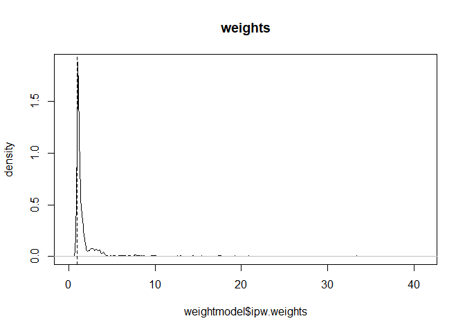
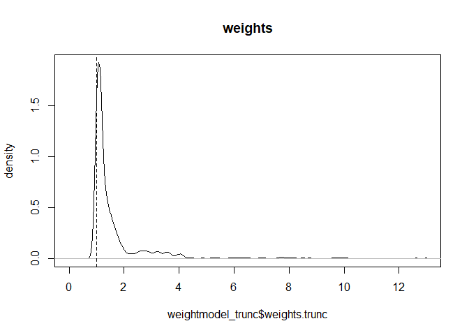

Causal Inference with R: IPTW
================
Mobin A Piracha
2020-03-16

The following is a data anlaysis project on Inverse Probability of
Treatment Weighting (IPTW) using R. This project is a apart of
Coursera’s “A Crash Course on Causality” taught by The University of
Pennsylvania. IPTW is a technique in R where we assign weights to
treatment and control groups based on their propsensities scores in
order to give subjects with similar characteristics in treated and
control equal weights in order to mirror a randomized trial. Therefore,
subjects in treatment and control groups with similar characteristics
will be reweighted according to their propensity scores. IPTW creates a
pseudo population by assigning inflating treated subjects with low
propensity scores and deflating control subjects with high propensity
scores. In most cases weighting is done because we have many more
control subjects than we have treated so we assign more weight to
treated subjects with low propensity scores in order to match them with
control subjects with similar characteristics.

For this analysis we will use the National Supported Work (NSW)
Demonstraton dataset which is a labor training program. We are
interested in estimating causal effects of this training program. We
will use IPTW to estimate causal effects.

``` r
library(tidyverse)
```

    ## -- Attaching packages --------------------------------------- tidyverse 1.3.0 --

    ## v ggplot2 3.3.3     v purrr   0.3.4
    ## v tibble  3.0.4     v dplyr   1.0.2
    ## v tidyr   1.1.2     v stringr 1.4.0
    ## v readr   1.4.0     v forcats 0.5.0

    ## -- Conflicts ------------------------------------------ tidyverse_conflicts() --
    ## x dplyr::filter() masks stats::filter()
    ## x dplyr::lag()    masks stats::lag()

``` r
library(pacman)
pacman::p_load(tableone, Matching, MatchIt, ipw, survey) 
data("lalonde")
age<-lalonde$age
education<-lalonde$educ
#since race has more than 3 categories we'll convert it into a binary variable for each race
lalonde$black <- ifelse(lalonde$race == 'black',1,0)
lalonde$hispanic <- ifelse(lalonde$race == 'hispanic',1,0)
lalonde$white <- ifelse(lalonde$race == 'white',1,0)
black <- lalonde$black
hispanic <- lalonde$hispanic
white <- lalonde$white
married<-lalonde$married
nodegree<-lalonde$nodegree
re74<-lalonde$re74
re75<-lalonde$re75
treatment<-lalonde$treat
re78<-lalonde$re78
mydata<- cbind(age, education, black, white, hispanic, married, nodegree, re74, re75, treatment, re78)
mydata<- data.frame(mydata)
View(mydata)
xvars<- c("age","education","black","white","hispanic","married","nodegree","re74", "re75")
expit<- function(x){1/(1+exp(-x))}
logit<-function(p){log(p)-log(1-p)}
```

First I will take a look at the pre-matching covariates through the
tableone package. Then I will use the ipw package and create a
propensity score model to get weights. I will also create a plot of
weights comparing propensity score to weights.

``` r
table1 <- CreateTableOne(vars=xvars,strata="treatment", data=mydata, test=FALSE)
print(table1,smd=TRUE)
```

    ##                        Stratified by treatment
    ##                         0                 1                 SMD   
    ##   n                         429               185                 
    ##   age (mean (SD))         28.03 (10.79)     25.82 (7.16)     0.242
    ##   education (mean (SD))   10.24 (2.86)      10.35 (2.01)     0.045
    ##   black (mean (SD))        0.20 (0.40)       0.84 (0.36)     1.668
    ##   white (mean (SD))        0.66 (0.48)       0.10 (0.30)     1.406
    ##   hispanic (mean (SD))     0.00 (0.00)       0.00 (0.00)    <0.001
    ##   married (mean (SD))      0.51 (0.50)       0.19 (0.39)     0.719
    ##   nodegree (mean (SD))     0.60 (0.49)       0.71 (0.46)     0.235
    ##   re74 (mean (SD))      5619.24 (6788.75) 2095.57 (4886.62)  0.596
    ##   re75 (mean (SD))      2466.48 (3292.00) 1532.06 (3219.25)  0.287

``` r
weightmodel<-ipwpoint(exposure = treatment, family = "binomial", link = "logit", denominator = ~ age+education+black+hispanic+married+nodegree+re74+re75, data = mydata)
summary(weightmodel$ipw.weights)
```

    ##    Min. 1st Qu.  Median    Mean 3rd Qu.    Max. 
    ##   1.010   1.058   1.163   1.918   1.608  33.347

``` r
ipwplot(weights = weightmodel$ipw.weights, logscale = FALSE, main = "weights", xlim = c(0, 41))
```

<!-- -->

``` r
mydata$wt<-weightmodel$ipw.weights
weighteddata<- svydesign(ids = ~1, data = mydata, weights = ~wt)
weightedtable<- svyCreateTableOne(vars = xvars, strata = "treatment", data = weighteddata, test = FALSE)
print(weightedtable, smd=TRUE)
```

    ##                        Stratified by treatment
    ##                         0                 1                 SMD   
    ##   n                      616.39            561.04                 
    ##   age (mean (SD))         27.05 (10.81)     25.18 (6.47)     0.210
    ##   education (mean (SD))   10.27 (2.74)      10.53 (2.02)     0.105
    ##   black (mean (SD))        0.40 (0.49)       0.44 (0.50)     0.090
    ##   white (mean (SD))        0.49 (0.50)       0.34 (0.47)     0.321
    ##   hispanic (mean (SD))     0.00 (0.00)       0.00 (0.00)    <0.001
    ##   married (mean (SD))      0.41 (0.49)       0.33 (0.47)     0.171
    ##   nodegree (mean (SD))     0.63 (0.48)       0.59 (0.49)     0.069
    ##   re74 (mean (SD))      4540.35 (6332.67) 3071.40 (5813.22)  0.242
    ##   re75 (mean (SD))      2171.27 (3161.58) 1785.23 (3139.19)  0.123

Pre-Matching standardized mean differences are first calculated. As you
can see these differences are much higher than the usual threshold of
0.2. After calculating weights we find that our weights are between 1
and 40. Density plot shows us observations and where majority of the
weights. Density plot shows that the majority of the subjects have low
values between 1-5 after which some subjects have values between 10-20
and very few have a weight above 30. The matching table after assigning
weights shows us that standardized differences are below the 0.2
threshold for almost all covariates. Now I wll calculate the risk
difference. I will calculate risk difference by fitting a marginal
structural model in the survey package.

``` r
msm<- (svyglm(re78~treatment, design = svydesign(~1, weights = ~wt, data = mydata)))
coef(msm)
```

    ## (Intercept)   treatment 
    ##   6416.2817    155.8414

``` r
confint(msm)
```

    ##                 2.5 %   97.5 %
    ## (Intercept)  5700.548 7132.016
    ## treatment   -1571.560 1883.243

``` r
summary(msm)
```

    ## 
    ## Call:
    ## svyglm(formula = re78 ~ treatment, design = svydesign(~1, weights = ~wt, 
    ##     data = mydata))
    ## 
    ## Survey design:
    ## svydesign(~1, weights = ~wt, data = mydata)
    ## 
    ## Coefficients:
    ##             Estimate Std. Error t value Pr(>|t|)    
    ## (Intercept)   6416.3      365.2  17.570   <2e-16 ***
    ## treatment      155.8      881.3   0.177     0.86    
    ## ---
    ## Signif. codes:  0 '***' 0.001 '**' 0.01 '*' 0.05 '.' 0.1 ' ' 1
    ## 
    ## (Dispersion parameter for gaussian family taken to be 51497882)
    ## 
    ## Number of Fisher Scoring iterations: 2

After estimating coefficients and confidence intervels, we find that our
estimate is insignificant at the 95% level. Now we will truncate weights
at 1st and 99th percentiles throught the trunc option in sylglm. We can
simply copy paste the code and add the truncated weights.

``` r
weightmodel_trunc<-ipwpoint(exposure = treatment, family = "binomial", link = "logit", denominator = ~ age+education+black+hispanic+married+nodegree+re74+re75, data = mydata, trunc = 0.01)
summary(weightmodel_trunc$weights.trunc)
```

    ##    Min. 1st Qu.  Median    Mean 3rd Qu.    Max. 
    ##   1.015   1.058   1.163   1.855   1.608  14.223

``` r
ipwplot(weights = weightmodel_trunc$weights.trunc, logscale = FALSE, main = "weights", xlim = c(0, 13))
```

<!-- -->

``` r
mydata$wt_trunc<-weightmodel_trunc$weights.trunc
weighteddata_trunc<- svydesign(ids = ~1, data = mydata, weights = ~wt_trunc)
weightedtable_trunc<- svyCreateTableOne(vars = xvars, strata = "treatment", data = weighteddata_trunc, test = FALSE)
print(weightedtable_trunc, smd=TRUE)
```

    ##                        Stratified by treatment
    ##                         0                 1                 SMD   
    ##   n                      616.41            522.29                 
    ##   age (mean (SD))         27.05 (10.81)     25.17 (6.59)     0.211
    ##   education (mean (SD))   10.27 (2.74)      10.46 (2.00)     0.077
    ##   black (mean (SD))        0.40 (0.49)       0.48 (0.50)     0.156
    ##   white (mean (SD))        0.49 (0.50)       0.31 (0.46)     0.382
    ##   hispanic (mean (SD))     0.00 (0.00)       0.00 (0.00)    <0.001
    ##   married (mean (SD))      0.41 (0.49)       0.28 (0.45)     0.268
    ##   nodegree (mean (SD))     0.63 (0.48)       0.62 (0.49)     0.019
    ##   re74 (mean (SD))      4540.75 (6333.24) 2895.97 (5854.10)  0.270
    ##   re75 (mean (SD))      2171.26 (3161.57) 1850.15 (3225.81)  0.101

``` r
msm_trunc<- (svyglm(re78~treatment, design = svydesign(~1, weights = ~wt_trunc, data = mydata)))
coef(msm_trunc)
```

    ## (Intercept)   treatment 
    ##   6416.5212    430.5534

``` r
confint(msm_trunc)
```

    ##                 2.5 %   97.5 %
    ## (Intercept)  5700.757 7132.285
    ## treatment   -1186.251 2047.358

``` r
summary(msm_trunc)
```

    ## 
    ## Call:
    ## svyglm(formula = re78 ~ treatment, design = svydesign(~1, weights = ~wt_trunc, 
    ##     data = mydata))
    ## 
    ## Survey design:
    ## svydesign(~1, weights = ~wt_trunc, data = mydata)
    ## 
    ## Coefficients:
    ##             Estimate Std. Error t value Pr(>|t|)    
    ## (Intercept)   6416.5      365.2  17.570   <2e-16 ***
    ## treatment      430.6      824.9   0.522    0.602    
    ## ---
    ## Signif. codes:  0 '***' 0.001 '**' 0.01 '*' 0.05 '.' 0.1 ' ' 1
    ## 
    ## (Dispersion parameter for gaussian family taken to be 52125708)
    ## 
    ## Number of Fisher Scoring iterations: 2

After assgining weights and truncating them, we find that our weights
are now between 1 and 13. Density plot shows that the majority of the
weights assigned are between 1 and 3, with some between 4-7 and very few
afterwards. Summary shows us that the estimates are not significant at
the 95% level.
