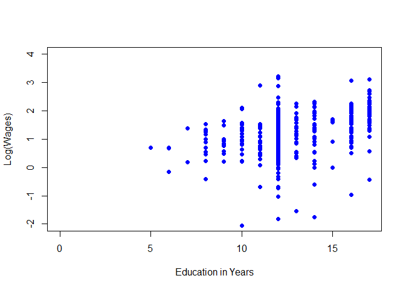

Causal Inference with R: Instrumental Variable Analysis
================
Mobin A Piracha
2020-03-17

The following is a data analysis project on Instrumental Variable
Analysis using R. Instrumental Variable aims to estimate causal effects
through an instrument (Z). A valid instrument is one that is correlated
with treatment but uncorrelated with outcome. The exclusion restriction
is the requirement that the instrument be uncorrelated with outcome. For
this analysis I will use the AER package and I will load dataset
(PSID1976 dataset) regarding labor force participation of married women.
I will complete a series of questions on the following link, which is a
practice exercise on instrumental variables on R-bloggers website:
<https://www.r-bloggers.com/instrumental-variables-in-r-exercises-part-1/>

``` r
library(tidyverse)
```

    ## -- Attaching packages --------------------------------------- tidyverse 1.3.0 --

    ## v ggplot2 3.3.3     v purrr   0.3.4
    ## v tibble  3.0.4     v dplyr   1.0.2
    ## v tidyr   1.1.2     v stringr 1.4.0
    ## v readr   1.4.0     v forcats 0.5.0

    ## -- Conflicts ------------------------------------------ tidyverse_conflicts() --
    ## x dplyr::filter() masks stats::filter()
    ## x dplyr::lag()    masks stats::lag()

``` r
library(psych)
```

    ## 
    ## Attaching package: 'psych'

    ## The following objects are masked from 'package:ggplot2':
    ## 
    ##     %+%, alpha

``` r
library(AER)
```

    ## Loading required package: car

    ## Loading required package: carData

    ## 
    ## Attaching package: 'car'

    ## The following object is masked from 'package:psych':
    ## 
    ##     logit

    ## The following object is masked from 'package:dplyr':
    ## 
    ##     recode

    ## The following object is masked from 'package:purrr':
    ## 
    ##     some

    ## Loading required package: lmtest

    ## Loading required package: zoo

    ## 
    ## Attaching package: 'zoo'

    ## The following objects are masked from 'package:base':
    ## 
    ##     as.Date, as.Date.numeric

    ## Loading required package: sandwich

    ## Loading required package: survival

``` r
library(ivpack)
data("PSID1976")
```

Now I will conduct summary statistics to find potential candiates for
Instrumental Variable Analysis

``` r
summary(PSID1976)
```

    ##  participation     hours          youngkids         oldkids     
    ##  no :325       Min.   :   0.0   Min.   :0.0000   Min.   :0.000  
    ##  yes:428       1st Qu.:   0.0   1st Qu.:0.0000   1st Qu.:0.000  
    ##                Median : 288.0   Median :0.0000   Median :1.000  
    ##                Mean   : 740.6   Mean   :0.2377   Mean   :1.353  
    ##                3rd Qu.:1516.0   3rd Qu.:0.0000   3rd Qu.:2.000  
    ##                Max.   :4950.0   Max.   :3.0000   Max.   :8.000  
    ##       age          education          wage           repwage         hhours    
    ##  Min.   :30.00   Min.   : 5.00   Min.   : 0.000   Min.   :0.00   Min.   : 175  
    ##  1st Qu.:36.00   1st Qu.:12.00   1st Qu.: 0.000   1st Qu.:0.00   1st Qu.:1928  
    ##  Median :43.00   Median :12.00   Median : 1.625   Median :0.00   Median :2164  
    ##  Mean   :42.54   Mean   :12.29   Mean   : 2.375   Mean   :1.85   Mean   :2267  
    ##  3rd Qu.:49.00   3rd Qu.:13.00   3rd Qu.: 3.788   3rd Qu.:3.58   3rd Qu.:2553  
    ##  Max.   :60.00   Max.   :17.00   Max.   :25.000   Max.   :9.98   Max.   :5010  
    ##       hage         heducation        hwage            fincome     
    ##  Min.   :30.00   Min.   : 3.00   Min.   : 0.4121   Min.   : 1500  
    ##  1st Qu.:38.00   1st Qu.:11.00   1st Qu.: 4.7883   1st Qu.:15428  
    ##  Median :46.00   Median :12.00   Median : 6.9758   Median :20880  
    ##  Mean   :45.12   Mean   :12.49   Mean   : 7.4822   Mean   :23081  
    ##  3rd Qu.:52.00   3rd Qu.:15.00   3rd Qu.: 9.1667   3rd Qu.:28200  
    ##  Max.   :60.00   Max.   :17.00   Max.   :40.5090   Max.   :96000  
    ##       tax           meducation       feducation         unemp         city    
    ##  Min.   :0.4415   Min.   : 0.000   Min.   : 0.000   Min.   : 3.000   no :269  
    ##  1st Qu.:0.6215   1st Qu.: 7.000   1st Qu.: 7.000   1st Qu.: 7.500   yes:484  
    ##  Median :0.6915   Median :10.000   Median : 7.000   Median : 7.500            
    ##  Mean   :0.6789   Mean   : 9.251   Mean   : 8.809   Mean   : 8.624            
    ##  3rd Qu.:0.7215   3rd Qu.:12.000   3rd Qu.:12.000   3rd Qu.:11.000            
    ##  Max.   :0.9415   Max.   :17.000   Max.   :17.000   Max.   :14.000            
    ##    experience    college   hcollege 
    ##  Min.   : 0.00   no :541   no :458  
    ##  1st Qu.: 4.00   yes:212   yes:295  
    ##  Median : 9.00                      
    ##  Mean   :10.63                      
    ##  3rd Qu.:15.00                      
    ##  Max.   :45.00

After taking a look at the summary statistics and the all variables we
find that father’s education could act as an instrument for conducting
instrumental variable analysis with 2SLS to estimate the returns to
schooling. However, before we conduct analysis we will a standard OLS
regression to show that when we regress log(wage) on education, we get
biased estimates because of confounding.

``` r
PSID1976$log_wage<-log(PSID1976$wage)
```

If we regress log(wage) on education we get an error because there are
no wages for females that did not participate in the workforce; wages
are based on participation rate. Therefore, we would only want to
conduct analysis on those individuals that were a part of the workforce.
We do thi using the subset function. Then we regress log wages of
education using the lm function. We then plot the data and make a line
of best fit.

``` r
part_data <- subset(PSID1976, participation == "yes")
OLS_Model<-lm(log_wage~education, data = part_data)
summary(OLS_Model)
```

    ## 
    ## Call:
    ## lm(formula = log_wage ~ education, data = part_data)
    ## 
    ## Residuals:
    ##      Min       1Q   Median       3Q      Max 
    ## -3.10256 -0.31473  0.06434  0.40081  2.10029 
    ## 
    ## Coefficients:
    ##             Estimate Std. Error t value Pr(>|t|)    
    ## (Intercept)  -0.1852     0.1852  -1.000    0.318    
    ## education     0.1086     0.0144   7.545 2.76e-13 ***
    ## ---
    ## Signif. codes:  0 '***' 0.001 '**' 0.01 '*' 0.05 '.' 0.1 ' ' 1
    ## 
    ## Residual standard error: 0.68 on 426 degrees of freedom
    ## Multiple R-squared:  0.1179, Adjusted R-squared:  0.1158 
    ## F-statistic: 56.93 on 1 and 426 DF,  p-value: 2.761e-13

``` r
{OLS_plot<-plot(log_wage~education, col = "blue", pch = 16, data = part_data, xlab="Education in Years", ylab="Log(Wages)", xlim= c(0, 17), ylim = c(-2, +4))
abline()}
```

<!-- -->

We find that on average, a one year increase in education leads to a
10.86% increase in wages. However, we believe that due to confounding,
we have biased estimates. Therefore, we may use an instrument (father’s
education) in try to estimate causal effects. We beleive father’s age is
a valid instrument because it is correlated with education but not
correlated with income. Let’s run a correlation matrix.

``` r
library(psych)
ivcor_mat <- part_data %>% 
  select(log_wage, education, feducation) %>% 
  corr.test()
ivcor_mat
```

    ## Call:corr.test(x = .)
    ## Correlation matrix 
    ##            log_wage education feducation
    ## log_wage       1.00      0.34       0.08
    ## education      0.34      1.00       0.42
    ## feducation     0.08      0.42       1.00
    ## Sample Size 
    ## [1] 428
    ## Probability values (Entries above the diagonal are adjusted for multiple tests.) 
    ##            log_wage education feducation
    ## log_wage       0.00         0       0.11
    ## education      0.00         0       0.00
    ## feducation     0.11         0       0.00
    ## 
    ##  To see confidence intervals of the correlations, print with the short=FALSE option

We find that father’s education is strongly correlated with education
(0.42), while very weakly correlated (0.08), therefore, we can consider
the exclusion restriction to be strongly met. Now that we know the
relationships between variables we will use the “ivpack” package to
estimate causal effects using two-stage least squares (2SLS) procedure.
We can do this procedure either through a series of regression or do it
directly with one regression using the IV pack. However, standard errors
may be incorrect.

``` r
firststage<-lm(education~feducation, data = part_data)
predictvalues<- firststage$fitted.values
stagetwo<- lm(part_data$log_wage~predictvalues)
summary(stagetwo)
```

    ## 
    ## Call:
    ## lm(formula = part_data$log_wage ~ predictvalues)
    ## 
    ## Residuals:
    ##     Min      1Q  Median      3Q     Max 
    ## -3.2126 -0.3763  0.0563  0.4173  2.0604 
    ## 
    ## Coefficients:
    ##               Estimate Std. Error t value Pr(>|t|)
    ## (Intercept)    0.44110    0.46711   0.944    0.346
    ## predictvalues  0.05917    0.03680   1.608    0.109
    ## 
    ## Residual standard error: 0.7219 on 426 degrees of freedom
    ## Multiple R-squared:  0.006034,   Adjusted R-squared:  0.003701 
    ## F-statistic: 2.586 on 1 and 426 DF,  p-value: 0.1086

``` r
ivmodel<-ivreg(log_wage~education,~ feducation, x = TRUE, data = part_data)
robust.se(ivmodel)
```

    ## [1] "Robust Standard Errors"

    ## 
    ## t test of coefficients:
    ## 
    ##             Estimate Std. Error t value Pr(>|t|)
    ## (Intercept) 0.441103   0.464287  0.9501   0.3426
    ## education   0.059173   0.036943  1.6017   0.1100

Therefore, according to our IV estimates, given a one unit increase in
father’s education is associated with a 1 year increase in education
leads to 5.9% increase in wages. However, you may find that standard
errors estimates may be inaccurate as these estimates are based on OLS
estimates and we want estimates based on 2SLS robust estimates.
Therefore, we can obtain robust estimates by using the IV pack. Now we
will obtain 90% confidence intervels for both the OLS regression and
2SLS.

``` r
confint(OLS_Model, level = 0.9)
```

    ##                     5 %      95 %
    ## (Intercept) -0.49053029 0.1201367
    ## education    0.08491139 0.1323859

``` r
confint(ivmodel, level = 0.9)
```

    ##                      5 %      95 %
    ## (Intercept) -0.292668709 1.1748755
    ## education    0.001370406 0.1169766

Therefore, if we repeated this exercise 100 times, 90% of the times our
estimates would be between 0.084-0.132 for education in the OLS model,
and between 0.001-0.116 for education in the IV model.
